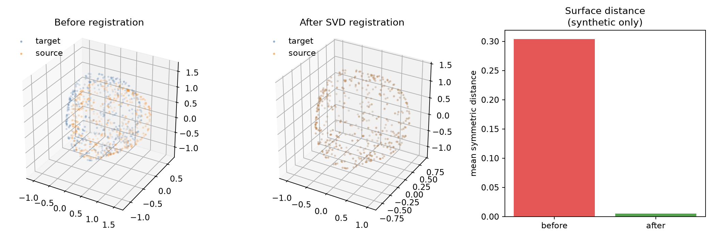

# Quantitative 3D Mesh Overlap Evaluation

[](https://github.com/Bahareh527/3d-mesh-overlap-evaluation/actions/workflows/ci.yml)
[](https://www.python.org/)
[](LICENSE)

A privacy-safe Python toolkit for rigidly aligning 3D point clouds and quantifying residual
surface and volumetric disagreement. It separates correspondence-based registration,
fully automatic Open3D registration, and evaluation so each stage can be tested independently.



## Registration and evaluation workflow

```text
source + target geometry
        |
        +-- known landmarks ------> closed-form SVD rigid transform
        |
        +-- no correspondences ---> voxel downsampling -> normals -> FPFH
                                      -> RANSAC/FGR -> point-to-plane ICP
                                                        |
aligned source + target -------------------------------+
        |
        +-> symmetric surface distance and Hausdorff distance
        +-> shared-grid voxel Dice and Jaccard overlap
```

## Engineering safeguards

- SVD alignment validates shapes, finite values, and non-collinear correspondences.
- Reflection solutions are corrected to return a proper rotation.
- All transformations are explicit source-to-target homogeneous 4x4 matrices.
- Surface metrics are symmetric; one-way nearest-neighbour error is not presented as complete.
- Dice and Jaccard use the same grid origin and voxel size for both point sets.
- Units and voxel size are never guessed from filenames.
- The Open3D workflow has no hard-coded paths, interactive point picking, or GUI requirement.
- Tests use generated geometry; no hospital-linked meshes or measurements are included.

## Quick start: synthetic verification

```bash
git clone https://github.com/Bahareh527/3d-mesh-overlap-evaluation.git
cd 3d-mesh-overlap-evaluation
python -m venv .venv
# Windows: .venv\Scripts\activate
# macOS/Linux: source .venv/bin/activate
python -m pip install -e ".[notebook]"
python scripts/run_synthetic_demo.py
```

The [executed notebook](notebooks/synthetic_registration_demo.ipynb) demonstrates the same
workflow on an asymmetric generated surface with a known rigid transform. Its numbers verify
the software only and are not measurements of a person, scanner, or medical outcome.

## Correspondence-based alignment

```python
from mesh_overlap import apply_transform, evaluate_alignment, rigid_transform_svd

transformation = rigid_transform_svd(source_landmarks, target_landmarks)
aligned_source = apply_transform(source_points, transformation)
metrics = evaluate_alignment(aligned_source, target_points, voxel_size=2.0)
print(metrics)
```

Coordinates and `voxel_size` must use the same unit. A voxel size of `2.0` means 2 mm only if
the point coordinates are actually expressed in millimetres.

## Automatic registration for local geometry files

Open3D is optional because it is a large dependency:

```bash
python -m pip install -e ".[open3d]"
mesh-overlap source.ply target.obj --voxel-size 2.0 --global-method ransac
```

The command samples triangle meshes when necessary, computes FPFH descriptors on downsampled
clouds, performs RANSAC or Fast Global Registration, and refines the result with point-to-plane
ICP. It prints the transform, fitness, and inlier RMSE as JSON.

## Interpreting the metrics

- **Mean symmetric surface distance** averages source-to-target and target-to-source nearest
  distances. It is reported in the coordinate unit.
- **Symmetric Hausdorff distance** records the worst nearest-surface discrepancy and is sensitive
  to outliers.
- **Voxel Dice and Jaccard** measure overlap between occupied voxels. They depend strongly on
  voxel resolution and are not interchangeable with overlap between watertight solid volumes.

Always report the coordinate unit, voxel size, sampling method, point count, preprocessing,
registration initialization, and failure cases. Inspect the alignment visually as well as
numerically; a local optimizer can converge to the wrong structure while still reducing error.


## Limitations and intended use

- The code is an educational research implementation, not a medical device.
- The synthetic example does not validate clinical accuracy or scanner quality.
- Rigid registration cannot model genuine soft-tissue deformation.
- ICP is a local method and depends on adequate initialization, overlap, and surface geometry.
- Sparse surface occupancy is only an approximation to volumetric overlap.

## Development

```bash
python -m pip install -e ".[dev]"
ruff check .
pytest
```

## References

- Arun, Huang, and Blostein, [Least-Squares Fitting of Two 3-D Point Sets](https://doi.org/10.1109/TPAMI.1987.4767965)
- Besl and McKay, [A Method for Registration of 3-D Shapes](https://doi.org/10.1109/34.121791)
- Rusu, Blodow, and Beetz, [Fast Point Feature Histograms for 3D Registration](https://doi.org/10.1109/ROBOT.2009.5152473)
- Zhou, Park, and Koltun, [Fast Global Registration](https://doi.org/10.1007/978-3-319-46475-6_47)
- Open3D, [Global registration tutorial](https://www.open3d.org/docs/latest/tutorial/pipelines/global_registration.html) and [ICP tutorial](https://www.open3d.org/docs/latest/tutorial/pipelines/icp_registration.html)

## License

The repository code is released under the [MIT License](LICENSE). Excluded geometry,
measurements, reports, and third-party software are not covered by this license.
